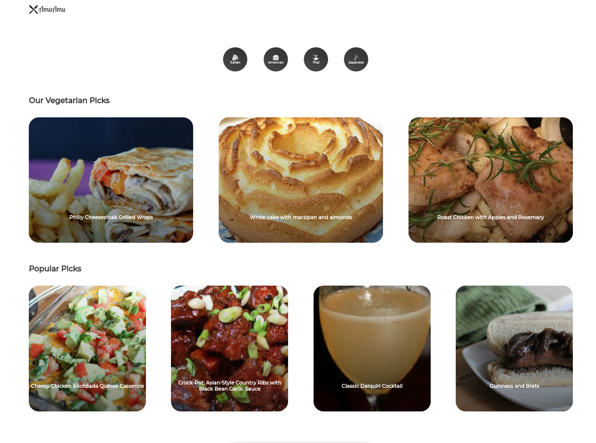

# AmuAmu

-----

The purpose of this application was to create a simple project based on react, that allows you to find some meals. This project is using all the basic and well known feuters of React.

### Tech stack
- React.js
- Node.js
- API: [Spoonacular API](https://spoonacular.com/food-api)

### Installation
- `.env` file is required
- `npm install` for required dependencies
- `npm start` for run application

